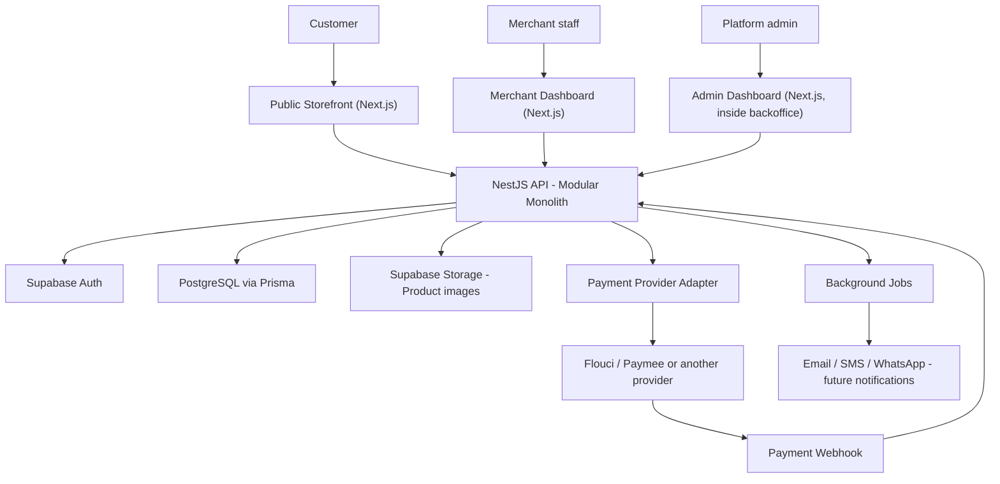

# System Architecture

## MVP architecture diagram



## Architecture decisions

1. **Modular monolith, not microservices.** Easier to build, test, deploy, and change as one founder/small team.
2. **Next.js serves storefront and backoffice.** Good for public storefront performance (SEO, speed) and internal dashboard UI.
3. **NestJS owns business rules and APIs.** Centralizes tenant security, orders, inventory, payments, and workflows.
4. **PostgreSQL is the source of truth.** Orders, payments, stock, and tenant data need reliable transactions.
5. **Supabase handles Auth and Storage.** Fast, managed identity (including Google/Facebook OAuth) and product-image storage.
6. **Payment providers use adapters.** Vendra can change or add Flouci, Paymee, or another provider later without rewriting checkout/orders.
7. **Payment webhook is the payment source of truth.** A customer returning from the payment page does not prove payment succeeded.

## Money rule

Customers pay the merchant through the payment provider (or via COD). Vendra stores payment status only. Vendra does not hold merchant or customer money.

## Monorepo structure

```
vendra/
├── apps/
│   ├── storefront/       # Public customer-facing store (Next.js, port 3000)
│   ├── backoffice/       # Merchant dashboard + platform admin (Next.js, port 3001)
│   └── api/              # NestJS backend (port 4000)
├── packages/
│   ├── ui/                # Shared shadcn-based components
│   ├── types/              # Shared TypeScript types/enums
│   ├── validation/          # Shared Zod schemas
│   └── config/              # Shared ESLint/TypeScript/Tailwind config
├── prisma/
│   ├── schema/
│   └── migrations/
├── docker/                 # Local PostgreSQL setup
└── docs/
    └── architecture/        # This folder
```

## Auth architecture

- **Supabase Auth** handles identity for merchants and platform admins: email/password, Google OAuth, Facebook OAuth.
- **Customers never authenticate.** Storefront checkout is guest-only — no Supabase Auth account is created for customers.
- **NestJS validates JWTs** issued by Supabase Auth on every protected request, using the `service_role` key (backend only, never exposed to the frontend).
- **Authorization (roles, organization membership)** lives in Vendra's own `memberships` table, not in Supabase — Supabase only proves *who* the user is, not *what* they're allowed to do.
- The `/admin` platform-admin routes live inside the `backoffice` app, gated by a `platform_admin` role rather than an `organization_id`.

## Database split: local vs. production

| | Local development | Production |
|---|---|---|
| Business data (`public` schema) | Docker PostgreSQL | Supabase-hosted PostgreSQL |
| Auth (`auth` schema) | Supabase cloud project (dev) | Supabase cloud project (prod) |

Docker Postgres is a disposable local stand-in for business data only. Auth always runs against a real Supabase project, even during local development. In production, business data moves into the same Supabase-hosted Postgres instance that already holds the `auth` schema — one database, two schemas.

## Billing (Vendra's own SaaS billing, not merchant payments)

Vendra does not use automated recurring billing. A merchant selects a plan, contacts Vendra, pays manually (bank transfer, cash, etc.), and a platform admin manually activates their plan and expiry date via the `/admin` panel. Entitlement checks are a simple `plan_status` / `plan_expires_at` lookup — no subscription webhooks, no payment-provider billing integration.
