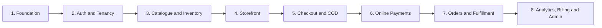

# Build Backlog & Milestones

## 1. Foundation — DONE

- Turborepo + pnpm workspace
- Next.js storefront app
- Next.js backoffice app
- NestJS API
- PostgreSQL, Prisma 7, Supabase project
- Docker local development
- Google + Facebook OAuth apps configured and wired to Supabase

## 2. Auth & Tenancy — NEXT

- Supabase Auth login/signup (email/password + Google/Facebook)
- `/auth/callback` route: exchange OAuth code for session
- Organization creation
- Merchant roles: owner, manager, fulfillment staff
- Platform admin role (not tied to an organization)
- `organization_id` tenant isolation in every query
- Merchant dashboard route protection

## 3. Catalogue & Inventory

- Products
- Product images (Supabase Storage)
- Variants: size, colour, SKU, price
- Stock per variant
- Inventory adjustments/history (ledger)
- Publish/unpublish product

## 4. Storefront

- Merchant public store URL (slug-based)
- Product catalogue
- Product detail page
- Variant selection
- Cart
- TND price display

## 5. Checkout & COD

- Guest checkout (no login)
- Tunisian phone validation
- Governorate, delegation, street address fields
- Delivery zones/prices
- COD order creation
- COD confirmation workflow

## 6. Online Payments

- Payment-provider adapter interface
- Connect merchant provider account (Flouci/Paymee)
- Create payment session
- Payment webhook verification (idempotent)
- Paid / failed / retry states

## 7. Orders & Fulfillment

- Merchant orders list
- Order detail
- Confirm / cancel COD order
- Pack / ship / deliver status updates
- Return / refusal reasons
- Shipment tracking number

## 8. Analytics, Billing & Admin

- Revenue and order metrics
- Low-stock alerts
- Manual plan/status tracking (no automated subscriptions)
- Platform admin merchant list
- Payment/webhook failure monitoring
- Audit logs

## Weekly demo targets

- **Week 1:** Merchant can sign up, create a store, and add products.
- **Week 2:** Customer can browse storefront, select variants, and use cart.
- **Week 3:** Customer can place a COD order; merchant can confirm and ship it.
- **Week 4:** Customer can pay through one provider; webhook marks order paid.
- **Week 5:** Merchant can fulfill orders, update stock, and see basic analytics.
