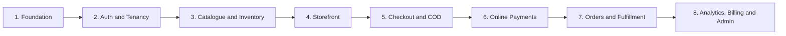

# Build Backlog & Milestones

## 1. Foundation — DONE

- Turborepo + pnpm workspace
- Next.js storefront app
- Next.js backoffice app
- NestJS API
- PostgreSQL, Prisma 7, Supabase project
- Local development database migrated from Docker to Supabase-hosted Postgres, so `auth` and business tables share one instance (required for the Postgres trigger described below)
- Google + Facebook OAuth apps configured and wired to Supabase

## 2. Auth & Tenancy — MOSTLY DONE

**Schema:**
- `Organization` (name, slug, category, logoUrl, tagline, brandColor, themeId, contactPhone, contactEmail, plan, planStatus, planExpiresAt)
- `Profile` (id matches Supabase `auth.users.id`, fullName, email, avatarUrl, phoneNumber)
- `Membership` (organizationId, profileId, role: owner/manager/fulfillment_staff — unique per org+profile, supports one person belonging to multiple orgs)
- `DeliveryZone` (organizationId, governorate enum covering all 24 Tunisian governorates, price, isActive)

**Auth flow:**
- Postgres trigger auto-creates a `Profile` row on every new `auth.users` insert (handles Google, Facebook, and email/password signups, with name fallback logic)
- Email/password signup, login, logout — working
- Google OAuth, Facebook OAuth — working
- Email confirmation flow — working, subject to Supabase's default rate limit; custom SMTP via Resend deferred until a real domain is purchased
- `/auth/callback` — exchanges OAuth/email-confirmation code for a session, forwards to `/auth/redirect`
- `/auth/redirect` — shared checkpoint after any successful auth (OAuth, email confirmation, or direct password login); checks membership count and branches:
  - 0 memberships → `/onboarding`
  - 1 membership → `/dashboard/[slug]` directly
  - 2+ memberships → `/choose-workspace`
- `/choose-workspace` — lists all orgs a user belongs to, navigates to `/dashboard/[slug]` on selection
- Slug-based tenant routing (`/dashboard/[slug]/...`) chosen over cookie-based active-org tracking, specifically to support multiple tabs on different orgs without shared-state conflicts
- `[slug]/layout.tsx` enforces tenant isolation: verifies the logged-in user actually has a membership in the org matching the URL slug before rendering anything; wrong slug redirects to `/choose-workspace`

**NestJS API:**
- `PrismaService` (Prisma 7 + `@prisma/adapter-pg`; pooled `DATABASE_URL` for runtime, direct `DIRECT_URL` for CLI/migrations via `prisma.config.ts`)
- `SupabaseStrategy` — Passport strategy verifying JWTs against Supabase's JWKS endpoint, not a static secret
- `SupabaseAuthGuard` — protects routes, attaches `{ userId, email, role }` to `req.user`
- `GET /auth/me` — returns the authenticated user's full list of memberships (org id, name, slug, role)
- `POST /organizations` — creates an Organization, its DeliveryZone rows, and an owner Membership in one Prisma transaction; pre-checks slug uniqueness for a friendly error; profileId taken from the verified JWT, never trusted from the request body
- Global `ValidationPipe` with `whitelist` + `forbidNonWhitelisted` — rejects requests containing unexpected fields
- CORS enabled for the backoffice origin

**Still open:**
- Real 5-step onboarding wizard UI (currently a placeholder page — schema and API fully support it, UI does not exist yet)
- Sidebar / org-switcher dropdown UI (routing and data support switching; no UI built)
- Resend "check your email" button on `/register/check-email`
- Custom SMTP (Resend) — deferred until a real domain is purchased
- Styling pass — deliberately deferred until core flows are functionally complete

## 3. Catalogue & Inventory — NOT STARTED

- Products
- Product images (Supabase Storage)
- Variants: size, colour, SKU, price
- Stock per variant
- Inventory adjustments/history (ledger)
- Publish/unpublish product

## 4. Storefront — NOT STARTED

- Merchant public store URL (slug-based)
- Product catalogue
- Product detail page
- Variant selection
- Cart
- TND price display
- Storefront themes (multiple planned — `Organization.themeId` field already reserved for this)

## 5. Checkout & COD — NOT STARTED

- Guest checkout (no login)
- Tunisian phone validation
- Governorate, delegation, street address fields
- Delivery zone pricing (per-governorate prices already modeled in `DeliveryZone`, not yet editable or used in checkout)
- COD order creation
- COD confirmation workflow

## 6. Online Payments — NOT STARTED

- Payment-provider adapter interface
- Connect merchant provider account (Flouci/Paymee)
- Create payment session
- Payment webhook verification (idempotent)
- Paid / failed / retry states

## 7. Orders & Fulfillment — NOT STARTED

- Merchant orders list
- Order detail
- Confirm / cancel COD order
- Pack / ship / deliver status updates
- Return / refusal reasons
- Shipment tracking number

## 8. Analytics, Billing & Admin — NOT STARTED

- Revenue and order metrics
- Low-stock alerts
- Manual plan/status tracking (no automated subscriptions) — `Organization.plan` / `planStatus` / `planExpiresAt` fields already exist
- Platform admin merchant list (inside `backoffice`, gated by a `platform_admin` role rather than an `organization_id`)
- Payment/webhook failure monitoring
- Audit logs

## Deferred to pre-launch (explicitly, not forgotten)

- Landing page / public marketing site
- Custom SMTP setup (Resend) once a real domain is purchased
- Full visual design pass across the whole app
- i18n (English, Arabic, French) — no work started, but noted for structural decisions going forward (avoid hardcoded left/right CSS, keep display strings easy to extract later)

## Weekly demo targets (original, still roughly on track)

- **Week 1:** Merchant can sign up, create a store, and add products. *(Sign up + auth: done. Store creation: API done, onboarding UI pending. Products: not started.)*
- **Week 2:** Customer can browse storefront, select variants, and use cart.
- **Week 3:** Customer can place a COD order; merchant can confirm and ship it.
- **Week 4:** Customer can pay through one provider; webhook marks order paid.
- **Week 5:** Merchant can fulfill orders, update stock, and see basic analytics.