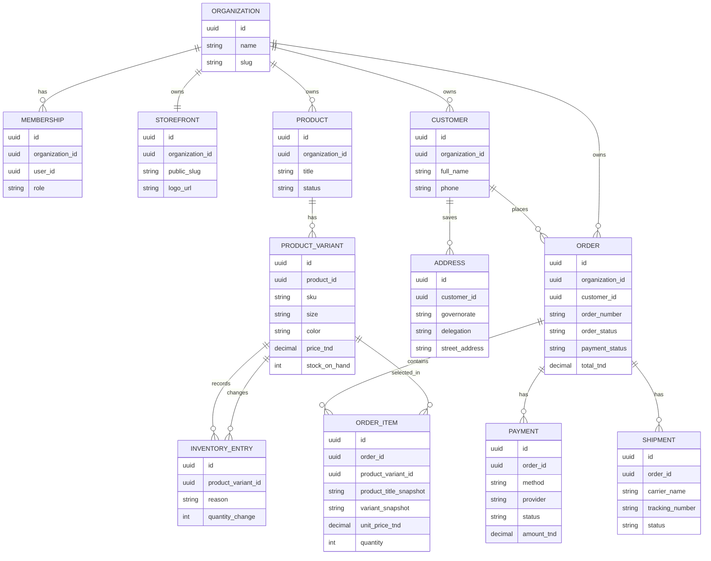
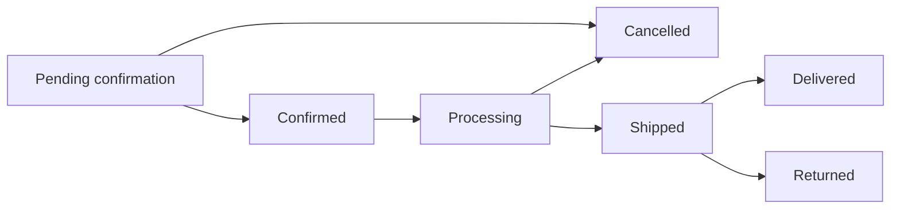
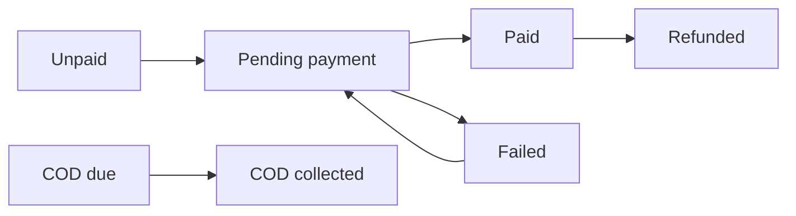
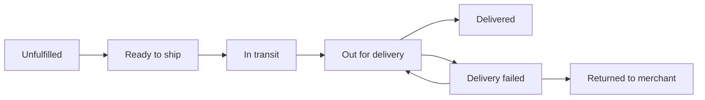

# Data Model

## Core entities



## Multi-tenancy rule

Every merchant-owned record belongs to one Organization. The app must always filter merchant data by `organization_id`.

Example: Merchant A must never see Merchant B's products, orders, customers, payments, or analytics.

## Order snapshot rule

When a customer orders a product, save the product title, selected size/colour, price, and delivery address inside the order. Later product edits must not change historical orders.

## Customer identity rule

Customers do not have Supabase Auth accounts. A customer record is created (or matched by phone number, within one organization) at the moment they place an order — not through any signup flow. Phone number is a useful identifier, not a globally unique one across the platform.

---

## Status systems

Keep these three systems separate. An order can be delivered while its COD money is still not reconciled, so one status is not enough.

### Order status



### Payment status



### Delivery status



**Status rule:** Order status = merchant fulfillment work. Payment status = whether/how the customer paid. Delivery status = courier/shipment progress. These are stored separately.

**Example — COD order mid-flow:**
```
Order:    Shipped
Payment:  COD due
Delivery: In transit

After successful delivery:
Order:    Delivered
Payment:  COD collected
Delivery: Delivered
```
