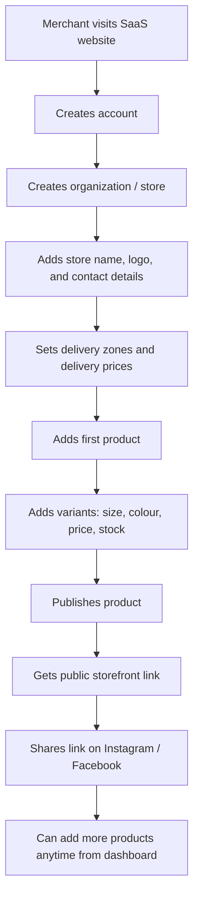
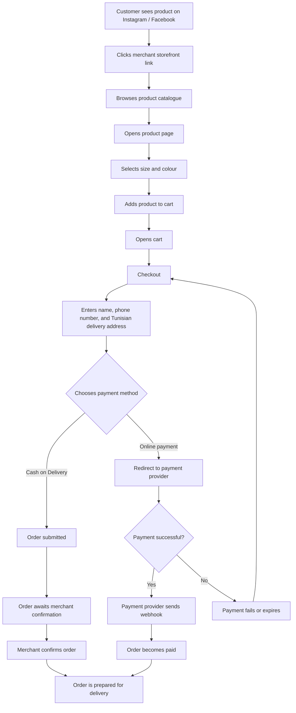
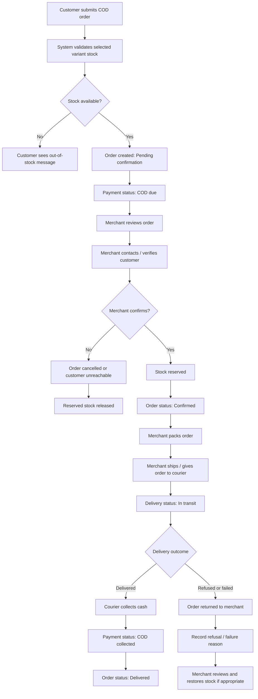
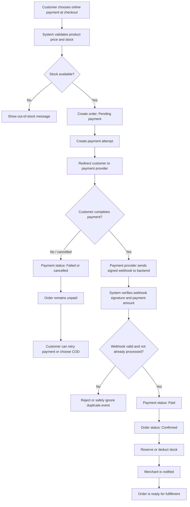
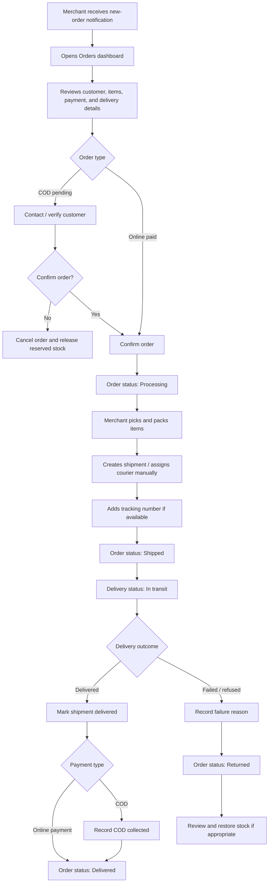

# User Flows

## 1. Merchant onboarding

**Success test:** A new merchant can create a store, publish one product, and get a public storefront link to share on social media.

---

## 2. Customer purchase journey

**Success test:** A customer can buy any published product, select an available variant, choose COD or online payment, and receive confirmation. No login required at any point.

---

## 3. Cash on Delivery (COD)

**COD rules:**

- Delivered does not automatically mean the merchant received remittance.
- COD collected means cash was collected from the customer.
- Cancelled COD orders release reserved stock.
- Refused/returned orders need a recorded reason.

---

## 4. Online payment lifecycle

**Online payment rules:**

- The payment-provider webhook is the source of truth — not the browser redirect.
- Duplicate webhooks must not create duplicate orders or payments (idempotency by provider event ID).
- Validate the paid amount and currency before marking an order paid.
- Card/payment information is handled by the payment provider, never stored by Vendra.
- Merchants connect their own payment-provider account (Flouci/Paymee); Vendra never holds customer money.

---

## 5. Merchant order fulfillment

**Success test:** A merchant can review a new order, confirm it, pack it, mark it shipped, record the delivery result, and keep order, payment, and inventory states accurate.
